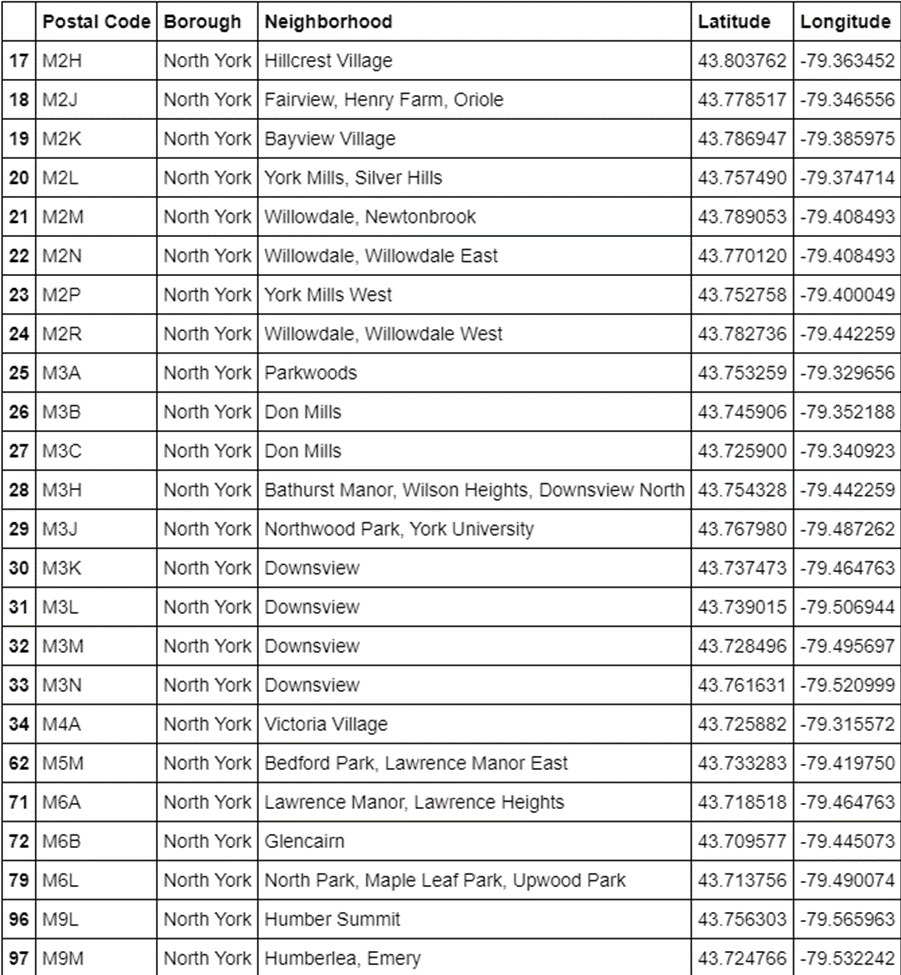
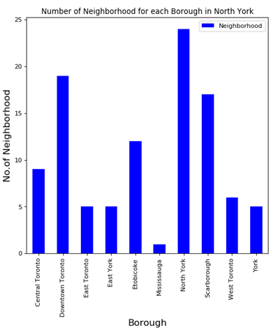
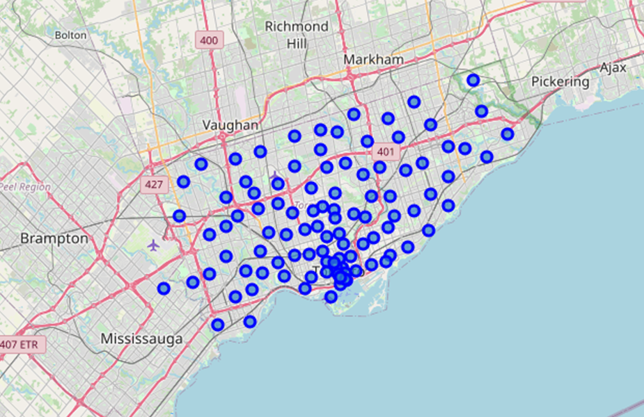
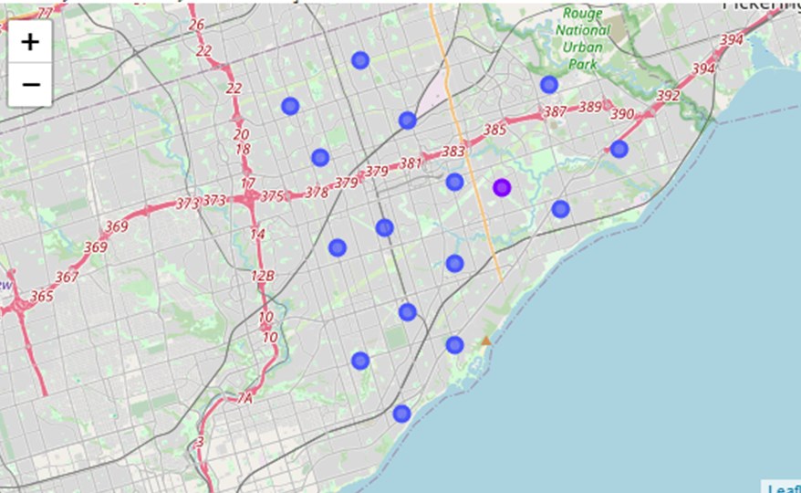
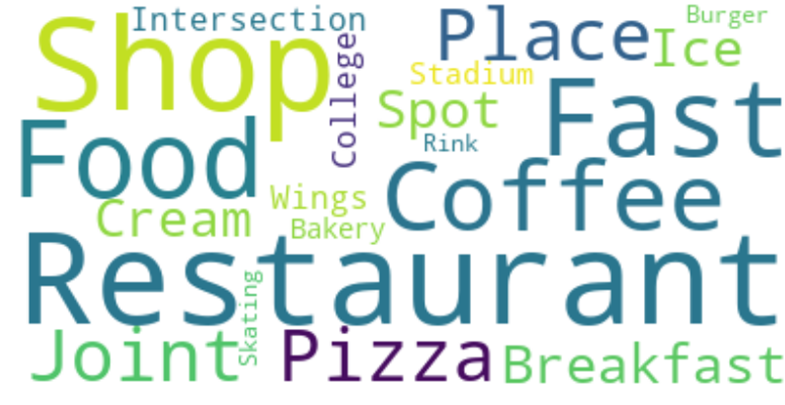
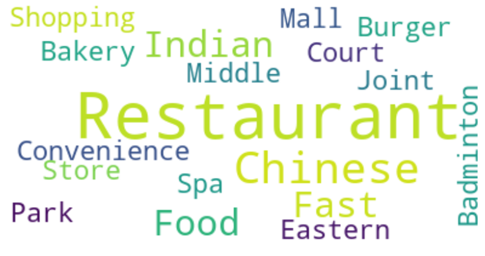
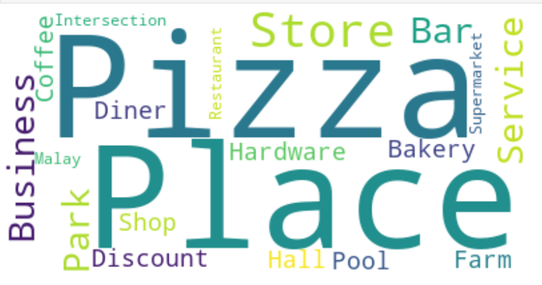

# Opening a Restaurant in North York, Toronto

## INTRODUCTION
The purpose of this project was to identify the current popularity of restaurants and the types of food businesses that exist in North York, Toronto. The end goal is to compare to the most common restaurants in New York City, New York. This project is focused on those who are interested in opening a restaurant within the North York area as opposed to New York City.
There are different factors to consider such the amounts of restaurants in the area as well as what are some of the most common places including stores, other food places, parks, etc. 
Using a city that is not as common as New York City provides an interest in exploring new regions of North America to expand restaurants to. 

## PROBLEM
North York is not a city many people have heard of; however, it is a large city filled with different types of shops, businesses and restaurants. Understanding the most common venues within North York will help individuals who are eager to open a restaurant in the city will see what is more favorable

## METHODOLOGY
The purpose of this is to identify if North York and Toronto are good areas to open up new restaurants based on the size of the city as opposed to opening up a new food spot in New York City. I used the data from https://en.wikipedia.org/wiki/List_of_postal_codes_of_Canada:_M to start generating
the dataframes required to populate the WordClouds and Geo-spatial data throughout the analysis. I also created a dataframe displaying the neighborhoods within North York:

This helps the reader scope the size of North York based on the neighborhoods within the borough

## DATA ACQUISITION
The Toronto neighborhood data will help us scope the size of each neighborhood; North York has the most neighborhoods out of all the boroughs:

 

 
 

Scraping the link provides the necessary details needed to understand the scope of North York. Combining this with Geo-spacial functionality visualizes the Toronto area to understand how large of a city it is. I scraped https://en.wikipedia.org/wiki/List_of_postal_codes_of_Canada:_M to gather the postal codes, then modified the data to only display values for North York. Using the Geo-Spatial

Below is an image of Toronto that was populated with clusters using clusters:

This is exposing the North York region of Toronto:

# Results

Using WordClouds I analyzed the venues that carried the most weight after creating multiple groups representing the clusters of most common venues:

The most common venues are food related locations including breakfast and coffee shops.

Indian and Chinese restaurants are the second most common food venues to eat at withing North York.

Pizza is the third most common and most popular of the criteria

The ranking is as followed:
1. General Restaurants
2. Breakfast Places
3. Coffee Shops
4. Indian Restaurants
5. Chinese Restaurants
6. Pizza Shops

## Discussion
When opening up a restuarant in a large city, the owners will have to identify what is missing from the community, another coffee shop or pizza shop will have a hard time with current competition that have already existed for years. 

## Conclusion
Opening up a restaurant will depend on the interest of the community and what is the current competition in the city already. Opening up another general restaurant (fast food for example) will have pros and cons within an overly saturated area. Having a niche market can help in a large city but it will be difficult for growth if there standards are not met and the community is not happy. 